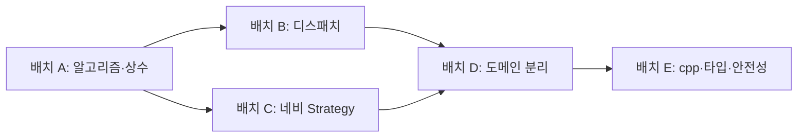

# Code Quality Report — `remoteKey.h` / `TVController.h`

> **리뷰 일자**: 2026-05-19 (전면 재검토)  
> **대상 파일**: `include/remoteKey.h`, `include/TVController.h`  
> **리뷰 관점**: SOLID, Clean Code, Code Smell, C++17, Design Pattern

---

## 0. 분석 범위

| 파일 | 역할 | LOC(대략) |
|------|------|-----------|
| `remoteKey.h` | 키 enum, 문자열 변환, 숫자 키 판별/변환 | 66 |
| `TVController.h` | 리모컨 입력 처리, 채널 FSM, 선호·검색·네비게이션 | 209 |

이전 07번 보고서의 `updateQuality()` 가정은 **폐기**했습니다. 현재 저장소에 해당 심볼은 없으며, 실제 진입점은 `TVController::pushButton()`입니다.  
두 헤더를 **동등한 분석 대상**으로 재검토했습니다.

---

## 1. 문제점 분석 표

| # | 문제점 | 위반 원칙 / 스멜 | 영향 | 개선 방향 | 우선순위 |
|---|--------|------------------|------|-----------|----------|
| 1 | `channelUpWithSearch` / `channelDownWithSearch` / `handleFavNext`에 동일한 “정렬 `vector<int>`에서 current 기준 next/prev + wrap” 알고리즘 3중 복제 | **Duplicated Code**, **Shotgun Surgery** | 한 경로만 수정 시 wrap·빈 목록·경계 버그 불일치 | `CyclicListNavigator::neighbor(current, sorted, Direction)` + `std::optional<int>`; **Template Method** 또는 공통 free 함수 | **1** |
| 2 | `channelUpWithoutSearch` / `channelDownWithoutSearch`의 `(ch±1+100)%100` 대칭 로직 | **Duplicated Code**, **Magic Number** (`100`, `99`) | up/down 규칙 변경 시 2곳 수정, `+99` 의도 불명확 | `ChannelRange::step(int ch, int delta)` + `constexpr` `kChannelCount` | **2** |
| 3 | `0`, `99`, `100`, `2`, `-1`, `'0'` 리터럴 산재 (`commitChannel`, wrap, digit 버퍼, 센티널) | **Magic Number** | 0~99 채널 도메인 변경 시 누락·오타 | `namespace tv::channel { inline constexpr int kMin, kMax, kCount, kMaxDigitLen; }` | **2** |
| 4 | `next = -1` / `prev = -1` 센티널로 “미발견” 표현 | **Magic Number**, 취약한 관례 | 유효 채널과 구분 모호, 의도 읽기 어려움 | `std::optional<int>` + `value_or(wrapTarget)` (C++17) | **1** |
| 5 | `pushButton()`의 digit 분기 + `switch (key)` 이중 구조 | **OCP** 위반, **Switch Statements** | `remoteKey` 추가마다 `switch`·테스트·리뷰 3곳 확장 | **Command** + **테이블 디스패치**: `unordered_map<remoteKey, KeyHandler>` 또는 `std::array` + 멤버 함수 포인터 | **3** |
| 6 | `TVController`가 키 라우팅·숫자 FSM·채널 검증·선호 CRUD·검색 수집·3종 네비·`std::cout`까지 담당 | **SRP** 위반, **God Class** | 단일 클래스 변경이 93개 테스트 전체 회귀 위험; 역할별 단위 테스트 불가 | **Facade**(`TVController`) + `DigitInputBuffer`, `FavoriteStore`, `SearchSession`, `IChannelNavigator` 분리 | **4** |
| 7 | `searchedChannels.empty()` / `favoriteChannels.empty()`에 따른 up/down 모드 분기가 `handleChannelUp/Down`에 하드코딩 | **OCP**, 높은 **조건문 복잡도** | “최근 시청” 등 4번째 모드 추가 시 분기·메서드 폭증 | **Strategy** / `std::variant<LinearNavigator, ListNavigator>` + `std::visit` (C++17) | **3** |
| 8 | 채널을 `std::string`↔`int`로 매 호출 변환 (`stoi`/`to_string`) | **Primitive Obsession**, **Duplicated Code** | 예외 지점 분산, 변환 비용·오류 메시지 불일치 | 내부 `ChannelNumber`(strong type) 또는 `int` 캐시 + `Tuner` 경계에서만 문자열 변환 | **5** |
| 9 | `commitChannel` 내 `std::cout` 직접 출력 | **SRP**, **DIP** (출력 결합) | 테스트·배포 환경에서 관측 불가 side effect | `IChannelObserver` / spdlog 주입, 또는 요구사항상 제거 | **4** |
| 10 | 전 구현이 헤더 인라인 (~200 LOC) | **Header Bloat**, 클래스 수준 **Long Method** | 변경 시 전 의존 TU 재컴파일, 캡슐화 약화 | `TVController.cpp` 분리, 헤더는 public API·전방 선언만 | **5** |
| 11 | `clearBufferBeforeNonDigitAction()` → `clearBuffer()` 1줄 위임 | **Needless Indirection** | 호출 스택만 증가, 이름만 다른 중복 | 비숫자 키 핸들러 공통 전처리를 **Decorator** 또는 테이블 래퍼 한 곳으로 | **5** |
| 12 | raw `Tuner*`, null 검사 없음 | 안전성 (SOLID 외) | 잘못된 주입 시 UB | `Tuner&` 참조 또는 `gsl::not_null` / 생성자 `assert` | **5** |
| 13 | `remoteKey.h`의 `to_string` 거대 `switch` (17 case) | **OCP**, **Duplicated Code** (enum과 문자열 이중 정의) | 키 추가 시 enum + switch 동기화 누락 | **X-Macro** 또는 `constexpr std::array<std::string_view, N>`로 단일 소스 | **3** |
| 14 | `isDigitKey` / `digitFromKey`가 enum **순서**에 의존 (`KEY_0`~`KEY_9` 연속) | **Fragile Base Class** 관례, **Magic Number** (`'0'`) | enum 재정렬 시 침묵 버그 | `switch` + `std::optional<char>` 또는 `static_assert` + `underlying_type` 검증 | **3** |
| 15 | `to_string`에 `default` 없음 — 미처리 enumerator 시 `return ""` | **Incomplete Switch** (경고 억제 패턴) | 새 enum 값 추가 시 빈 문자열 반환 | `[[nodiscard]]` + `default: throw` 또는 컴파일 타임 테이블로 exhaustiveness 보장 | **4** |
| 16 | `handleSearch`의 `while (true)` + `empty()` break | **Loop** 스멜 (의도 불명확) | 가독성·테스트 mock 호출 횟수 결합 | range 기반: `for (auto ch = tuner.seekCH(); !ch.empty(); ch = tuner.seekCH())` 또는 `ITunerSeekIterator` | **5** |
| 17 | `toggleFavorite`가 find·erase·push·sort를 한 메서드에서 수행 | **Long Method** (미니), **SRP** | 정렬 정책·중복 제거 규칙 변경 시 혼재 | `FavoriteStore::toggle(int)` — **Repository** 스타일 | **4** |
| 18 | `pushButton` `default: break` — 미지원 키 무음 무시 | **Fail Silent** | 잘못된 enum 전달 시 디버깅 어려움 | `default`에서 `assert` / 로그 / no-op 정책 명시 | **5** |

**우선순위 기준**: 1=즉시·고위험·저비용, 5=구조 개편·동작 불변 정리.

---

## 2. SRP / OCP / 기타 SOLID — 근거

### 2.1 `TVController` — SRP

| 변경 이유 | 담당 코드 |
|-----------|-----------|
| 리모컨 키 라우팅 | `pushButton` |
| 숫자 입력 FSM (버퍼, 2자리 커밋, OK) | `handleDigit`, `handleOk`, `processingCH` |
| 채널 도메인 검증·커밋 | `commitChannel`, `commitBufferedDigits` |
| 선호 채널 집합 | `toggleFavorite`, `handleFavNext`, `favoriteChannels` |
| 검색 세션 | `handleSearch`, `searchedChannels` |
| 채널 이동 정책 | `channelUp*` / `channelDown*` (6 메서드) |
| 사용자 출력 | `commitChannel` 내 `std::cout` |

**6개 이상의 독립 변경 축** → 단일 클래스는 SRP를 실질적으로 위반합니다.

### 2.2 `TVController` — OCP

- **키 확장**: `remoteKey` + `pushButton` switch 동시 수정.
- **네비게이션 모드 확장**: `handleChannelUp/Down`의 `if (searchedChannels.empty())` 분기 확장 필요.
- **알고리즘 확장**: 정렬 목록 순환 로직이 3곳에 복사되어, 정책 수정 시 **3곳을 열어야** 함 → 확장에 닫혀 있지 않음.

### 2.3 `remoteKey.h` — SRP / OCP

- **SRP**: 한 헤더가 (1) 도메인 enum, (2) 직렬화, (3) 숫자 키 도메인 로직을 포함. 규모상 허용 가능하나, `to_string`이 컨트롤러 디버그·로깅 요구와 결합되면 책임이 비대해짐.
- **OCP**: 키 1개 추가 = enum 1줄 + `to_string` case 1줄 + (간접) `pushButton` case 1줄 → **3곳 수정**.

### 2.4 DIP / ISP (부가)

- `TVController`가 구체적 `std::cout`에 의존 → 고수준 정책이 저수준 I/O에 결합 (**DIP** 위반).
- `Tuner` 인터페이스는 적절하나, 컨트롤러가 `seekCH` 루프·`setCH`·`getCurrentCH` 전부를 직접 오케스트레이션 (**Facade** 미적용).

---

## 3. Code Smell 요약

| 스멜 | 위치 | 심각도 |
|------|------|--------|
| **Duplicated Code** | 정렬 벡터 순환 탐색 ×3; wrap up/down ×2 | 높음 |
| **God Class** | `TVController` 전체 | 높음 |
| **Switch Statements** | `pushButton`, `remoteKey::to_string` | 중간 |
| **Magic Number** | `0/99/100/2/-1/+99/'0'` | 중간 |
| **Primitive Obsession** | 채널 `string`↔`int` 반복 변환 | 중간 |
| **Long Method** (집계) | 헤더 인라인 전 메서드 | 중간 |
| **Feature Envy** | 네비게이션이 `favoriteChannels`/`searchedChannels` 내부 순회 | 중간 |
| **Message Chains** | `getCurrentChannelInt` → `tuner->getCurrentCH()` → `stoi` | 낮음 |
| **Speculative Generality** | `clearBufferBeforeNonDigitAction` | 낮음 |
| **Incomplete Library Class** | `remoteKey`에 도메인 헬퍼만 있고 확장 포인트 없음 | 낮음 |

---

## 4. C++17 스타일 · Design Pattern 적용

### 4.1 즉시 적용 (패턴 + C++17)

| 패턴 | 적용 대상 | 스케치 |
|------|-----------|--------|
| **공통 알고리즘 추출** | #1, #4 | `std::optional<int> cyclicNeighbor(int cur, const std::vector<int>& sorted, enum class Dir {Fwd, Back});` |
| **constexpr 상수** | #2, #3 | `inline constexpr int kChannelCount = 100;` |
| **Command + 테이블** | #5 | `using Handler = void(TVController::*)(); static const std::unordered_map<remoteKey, Handler> kMap;` |
| **Strong typedef** | #8 | `struct ChannelNumber { int value; explicit ChannelNumber(int); };` |
| **X-Macro / constexpr table** | #13, #14 | `REMOTE_KEY_LIST(X)` 한 번으로 enum·`string_view`·digit 여부 동기화 |

### 4.2 중기 적용

| 패턴 | 적용 대상 | 비고 |
|------|-----------|------|
| **State** | 숫자 버퍼 FSM (`Idle` → `Buffering` → `Commit`) | `processingCH` + 2자리 규칙을 명시적 상태로 |
| **Strategy** | linear vs search-list vs favorite-list 네비 | #7; 현재 3모드 — variant 3종이면 충분 |
| **Facade** | `TVController` | 분리된 서브시스템을 조합만 |
| **Repository** | `FavoriteStore`, `SearchSession` | #17; vector 캡슐화 |
| **Observer** | 채널 변경 알림 | `commitChannel`의 cout 대체 |

### 4.3 과도하지 않은 선택

- **Abstract Factory / Builder** for keys: 키 15개 규모에는 과함.
- **Visitor on `remoteKey`**: 테이블 디스패치로 대체 가능.

---

## 5. 리팩토링 우선순위 (1~5, 8항목)

| 순위 | 항목 | 이유 |
|------|------|------|
| **1** | #1 + #4: 정렬 벡터 순환 탐색 단일화 + `optional` | **최대 버그 면적**; 3중 복제; 기존 93 테스트로 회귀 검증 용이 |
| **2** | #2 + #3: 채널 `constexpr` + `stepChannel` | 저비용·고수익; `+99` 의도 문서화 |
| **3** | #5 + #13 + #14: 키 디스패치·`remoteKey` 테이블화 | **OCP**; 키 추가 비용을 “등록 1곳”으로 |
| **4** | #6 + #9 + #17: 역할 분리 + I/O 제거 + `FavoriteStore` | **SRP**; 장기 유지보수·테스트 격리 |
| **5** | #8 + #10 + #11 + #12 + #16 + #18: 구조 정리 | 동작 동일 전제; 컴파일·안전성·가독성 |

---

## 6. Refactoring 계획 (배치별 묶음)

한 번의 PR/작업 단위로 묶은 계획입니다. **배치 간 순서를 지키면** 각 단계 후 `ctest`로 회귀 확인이 가능합니다.

### 배치 A — 알고리즘·상수 (동작 불변, 리스크 낮음)

| Refactoring Point | 포함 이슈 | 작업 내용 | 검증 |
|-------------------|-----------|-----------|------|
| A1 | #1, #4 | `cyclicNeighbor()` + `std::optional` | search up/down, fav next 테스트 |
| A2 | #2, #3 | `tv::channel` constexpr + `stepChannel(ch, ±1)` | wrap 0↔99, up/down 테스트 |
| A3 | #16 | `handleSearch` 루프 가독성 개선 | search 수집 테스트 |

**예상 diff**: `TVController.h` 내부 private 헬퍼 추가, 리터럴 치환.  
**패턴**: 공통 함수 추출, constexpr.

---

### 배치 B — 입력 계층·디스패치 (OCP)

| Refactoring Point | 포함 이슈 | 작업 내용 | 검증 |
|-------------------|-----------|-----------|------|
| B1 | #13, #14, #15 | `remoteKey.h` X-Macro 또는 `constexpr` 테이블; digit helper 안전화 | 기존 `to_string`·digit 테스트 |
| B2 | #5, #11 | `pushButton` → 핸들러 맵; 비숫자 공통 `clearBuffer` 래퍼 통합 | 전 키 시나리오 테스트 |
| B3 | #18 | 미지원 키 정책 명시 (`assert` 또는 no-op 문서화) | — |

**예상 diff**: `remoteKey.h` + `pushButton` 구조 변경.  
**패턴**: Command, 테이블 디스패치.

---

### 배치 C — 네비게이션 전략 (OCP, 중간 규모)

| Refactoring Point | 포함 이슈 | 작업 내용 | 검증 |
|-------------------|-----------|-----------|------|
| C1 | #7 | `IChannelNavigator` / `variant`로 up·down 위임 | search on/off, fav next |
| C2 | #1 연계 | `ListNavigator`가 배치 A의 `cyclicNeighbor` 재사용 | 중복 제거 유지 |

**패턴**: Strategy, `std::variant` + `std::visit`.

---

### 배치 D — 도메인 분리 (SRP, 큰 규모)

| Refactoring Point | 포함 이슈 | 작업 내용 | 검증 |
|-------------------|-----------|-----------|------|
| D1 | #6, #17 | `DigitInputBuffer`, `FavoriteStore` 추출 | digit·fav 시나리오 |
| D2 | #6 | `SearchSession` + `LinearNavigator` / `ListNavigator` | search·ch up/down |
| D3 | #9 | `cout` → Observer 제거 또는 주입 | 출력 비의존 테스트 |
| D4 | #6 | `TVController`를 Facade로 축소 | 전체 93 테스트 |

**패턴**: Facade, Repository, Observer.

---

### 배치 E — 구조·안전성 (마무리)

| Refactoring Point | 포함 이슈 | 작업 내용 | 검증 |
|-------------------|-----------|-----------|------|
| E1 | #10 | `.h`/`.cpp` 분리 | 빌드·전체 테스트 |
| E2 | #8 | `ChannelNumber` strong type, tuner 경계 변환 | stoi 예외 테스트 |
| E3 | #12 | `Tuner&` 참조화 | Mock 주입 동일 |
| E4 | #5 | (선택) `remoteKey`와 컨트롤러 핸들러 등록 단일화 | — |

---

### 배치 의존 관계

---

## 7. 개선 방향 요약

### `remoteKey.h`

- enum과 문자열·digit 판별을 **단일 소스(X-Macro / constexpr table)** 로 묶어 OCP를 만족시킵니다.
- `isDigitKey` / `digitFromKey`의 **순서 의존**을 제거해 enum 재배치에 안전하게 만듭니다.

### `TVController.h`

- **단기(배치 A)**: 3중 복제된 순환 탐색과 매직 넘버를 제거하는 것이 ROI 최대입니다.
- **중기(배치 B~C)**: `pushButton`과 네비게이션을 테이블·Strategy로 열어 새 키·새 모드 추가 시 기존 코드를 닫습니다.
- **장기(배치 D~E)**: God Class를 Facade + 작은 도메인 타입으로 쪼개 93개 테스트를 역할별로 분할 가능하게 합니다.

### 한 줄 결론

**기능은 요구사항을 충족하나, “정렬 벡터 순환 이동” 3중 복제와 “키·채널 리터럴” 산재가 가장 위험합니다.** C++17의 `optional`·`constexpr`·`variant`와 Command/Strategy/Facade를 **배치 A→B→C→D→E** 순으로 적용하면, 각 단계마다 전체 테스트로 회귀를 막으면서 구조를 개선할 수 있습니다.

---

## 8. 참고 코드 위치

| 관심사 | 파일 | 라인(대략) |
|--------|------|------------|
| 키 디스패치 | `TVController.h` | 177–205 |
| 순환 탐색 중복 | `TVController.h` | 83–96, 98–110, 155–171 |
| 채널 wrap | `TVController.h` | 73–80, 39–40 |
| 2자리 커밋 | `TVController.h` | 55–59 |
| `to_string` switch | `remoteKey.h` | 35–55 |
| digit 판별/변환 | `remoteKey.h` | 57–63 |
| Tuner 계약 | `Tuner.h` | 17–23 |

---

*문서 버전: 2.0 — `remoteKey.h` + `TVController.h` 전면 재검토*
