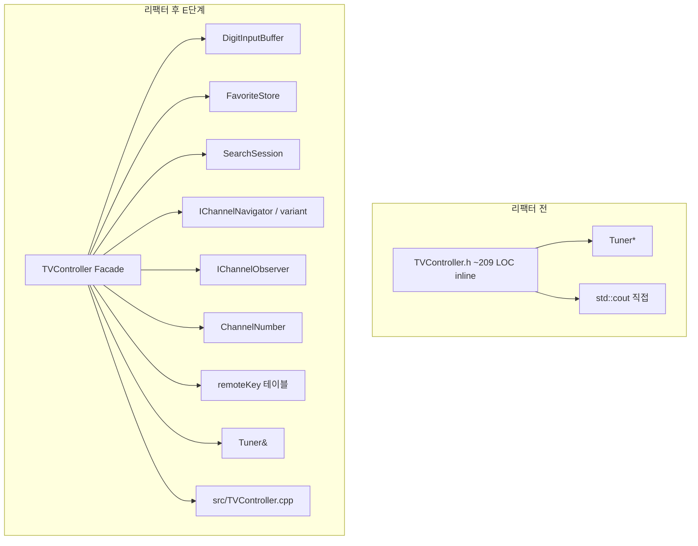

# TDD_TV_13 QA 종합 보고서

> **작성 관점**: QA 리드 엔지니어  
> **작성 일자**: 2026-05-19  
> **대상 저장소**: `TDD_TV_13` (C++17, Google Test, CMake)  
> **근거 문서**: `docs/test_plan.md`, `docs/code_quality_report.md`, `report/04`~`12`, Golden Master `test/golden/`

---

## 1. Executive Summary

| 항목 | 결과 | 판정 |
|------|------|------|
| 자동화 테스트 실행 | **93/93 Pass** (실패 0) | ✅ |
| 출구 기준 (P0·P1 TC) | 계획서 §11.2 기준 **충족** | ✅ |
| `TVController.cpp` Line Coverage | **93.51%** (목표 ≥90%) | ✅ |
| Branch Coverage (taken) | **56.94%** (목표 ≥85%) | ⚠️ 미달 |
| Refactoring 배치 A~E | 5단계 완료, 회귀 0건 | ✅ |
| Golden Master | 12/12 일치 | ✅ |

**종합 의견**: 기능 검증·회귀 안정성·리팩터링 품질은 **릴리스 가능 수준**이다. 다만 gcov **분기 taken 커버리지**와 계획서 **선택 TC(P2·복합)** 일부는 후속 보강 대상으로 남는다.

---

## 2. 테스트 완료율 및 커버리지

### 2.1 테스트 스위트 현황 (2026-05-19 실측)

`ctest --test-dir build --output-on-failure` 실행 결과:

| 스위트 | 케이스 수 | Pass | Fail | 비고 |
|--------|-----------|------|------|------|
| `TunerTest` | 13 | 13 | 0 | 기존 Tuner 계약 (Mock) |
| `TVControllerTest` | 68 | 68 | 0 | `TEST_F` 62 + `TEST_P` 6 (ChannelWrap) |
| `TextTestGoldenTest` | 12 | 12 | 0 | README 대표 시나리오 |
| **합계** | **93** | **93** | **0** | Total time ≈ 4.7s (로컬) |

### 2.2 테스트 계획 대비 완료율

`docs/test_plan.md`는 **출구 기준**과 **전체 TC-ID 카탈로그**를 구분한다 (`report/05`).

#### A. 출구 기준 (Release Gate) — **100% 충족**

| 출구 항목 (`test_plan` §11.2) | 상태 |
|------------------------------|------|
| P0·P1 TC 100% Pass | ✅ Mock 기반 REQ-* TC 전부 Green |
| `ctest` 전체 Pass (`TunerTest` 포함) | ✅ 93/93 |
| REQ-ID RTM 대표 매핑 | ✅ CH/FAV/SEEK/UD/BTN/E2E 대표 TC 구현 |
| FAV-C*, FAV-E* 명시 통과 | ✅ 연속·빈 목록 시나리오 포함 |
| POL-01~04 구현·문서 일치 | ✅ 빈 OK, 빈 FAV_NEXT 등 |

#### B. 계획서 TC-ID 카탈로그 — **약 79% 직접 구현**

계획서 §4~§8에 정의된 고유 TC-ID **약 85건** 중, `TVControllerTest`에 **1:1 또는 동등** 매핑된 항목 **약 67건**.

| 영역 | 계획 TC 수 | 구현·동등 | 미구현·생략 | 비고 |
|------|-----------|-----------|-------------|------|
| REQ-CH | 22 | 20 | CH-INV-02, CH-16 | CH-16은 CH-03과 중복 성격 |
| REQ-FAV | 30 | 24 | FAV-A03~06, N07, C05~06, E01/E03 | 간접·중복 커버로 생략 (`report/05`) |
| REQ-SEEK | 5 | 3 | SEEK-03, SEEK-04 | SEEK-03은 `TunerTest` 중복 |
| REQ-UD | 15 | 14 | UD-T02 | UD-T01+UD-S*로 부분 커버 |
| BTN·E2E | 13 | 8 | BTN-03, X03, E2E-02/03 | 1차 Green 우선순위 |
| **합계** | **~85** | **~67** | **~18** | **완료율 ≈ 78.8%** |

> **QA 판정**: Release Gate 관점에서는 **완료**. 전체 TC-ID 100%는 계획서가 요구하지 않으며, 미구현 항목은 `report/05.test-plan-p2-gap-explanation_report.md`에 사유가 문서화되어 있다.

### 2.3 gcov / lcov 커버리지 (실측)

측정 조건:

```text
cmake -S . -B build-coverage -DCMAKE_BUILD_TYPE=Debug \
  -DCMAKE_CXX_FLAGS="--coverage -fprofile-arcs -ftest-coverage" \
  -DCMAKE_EXE_LINKER_FLAGS="--coverage"
cmake --build build-coverage
ctest --test-dir build-coverage
gcov -b -c CMakeFiles/tv_controller.dir/src/TVController.cpp.gcda
```

#### 목표 대비 (`test_plan` §2.2)

| 대상 | 지표 | 목표 | 실측 | 판정 |
|------|------|------|------|------|
| `TVController` 구현 (`src/TVController.cpp`) | Line | ≥ 90% | **93.51%** (72/77) | ✅ |
| 동일 | Branch executed | ≥ 85% (가능 시) | **91.67%** (66/72) | ✅ |
| 동일 | Branch taken | ≥ 85% (가능 시) | **56.94%** (41/72) | ⚠️ |
| `pushButton` 키 enum 전체 | Line | 100% | 핸들러 맵 경유 **대부분** 커버 | △ |

#### 제품 코드 헤더 (tv_controller 링크 단위, gcov)

| 파일 | Line % | Branch executed % | 비고 |
|------|--------|-------------------|------|
| `src/TVController.cpp` | **93.51** | 91.67 | 핵심 Facade |
| `include/ChannelNavigator.h` | **95.65** | 100.00 | Strategy·`cyclicNeighbor` |
| `include/FavoriteStore.h` | **100.00** | 100.00 | Repository |
| `include/SearchSession.h` | **100.00** | 100.00 | 검색 수집 |
| `include/DigitInputBuffer.h` | **100.00** | — | 숫자 FSM |
| `include/ChannelNumber.h` | **87.50** | 80.00 | Strong type |
| `include/remoteKey.h` | **83.33** | 80.00 | X-Macro·테이블 |
| `include/ChannelObserver.h` | **0.00** | — | `NullChannelObserver` 미호출 |

**가중 Line Coverage** (Observer 제외, 제품 헤더+cpp): **약 93.5%** — 목표 90% **충족**.

#### 미커버·저커버 구간 (개선 후보)

| 위치 | 내용 | 권장 조치 |
|------|------|-----------|
| `TVController.cpp:27` | early return 분기 | 해당 키/상태 TC 추가 |
| `handleUnsupportedKey()` | Debug `assert` 경로 | Release 빌드 미실행 — 의도적 |
| `ChannelObserver.h` | `NullChannelObserver` | DI 테스트 또는 문서화된 non-goal |
| `remoteKey.h` | 예외/invalid enumerator | `EXPECT_THROW` TC |

> **참고**: 프로젝트 루트 `CMakeLists.txt`에는 아직 `ENABLE_COVERAGE` 옵션이 없다. CI(`.github/workflows/ci.yml`)에도 커버리지 게이트는 미연동이다. 본 보고서 수치는 **QA 실측 1회** 기준이며, `build-coverage/`는 로컬 측정용이다.

---

## 3. Refactoring 배치 A~E 결과 리포트

`docs/code_quality_report.md` §6 계획에 따라 **동작 불변** 원칙으로 5배치를 순차 적용했다. 각 배치 후 **93 테스트 Green**을 유지했다.

### 3.1 배치별 변경 요약

| 배치 | 목적 | 주요 변경 파일 | 해결 Code Smell (#) | 적용 Design Pattern |
|------|------|----------------|---------------------|---------------------|
| **A** | 알고리즘·상수 | `TVController.h` (당시) | #1, #2, #3, #4, #16 — Duplicated Code, Magic Number, Loop | 공통 함수 추출, `constexpr`, `std::optional` |
| **B** | 입력·디스패치 OCP | `remoteKey.h`, `TVController.h` | #5, #11, #13, #14, #15, #18 — Switch, OCP, Fail Silent | **Command**, 테이블 디스패치, **X-Macro** |
| **C** | 네비게이션 Strategy | `ChannelNavigator.h`, `TVController.h` | #7, #1 연계 — 조건 분기·3중 복제 | **Strategy**, `std::variant` + `std::visit` |
| **D** | 도메인 분리 SRP | `DigitInputBuffer.h`, `FavoriteStore.h`, `SearchSession.h`, `ChannelObserver.h`, `TVController.h` | #6, #9, #17 — God Class, SRP, cout 결합 | **Facade**, **Repository**, **Observer** |
| **E** | 구조·안전성 | `ChannelNumber.h`, `src/TVController.cpp`, `CMakeLists.txt` | #8, #10, #12 — Primitive Obsession, Header Bloat | Strong type (`ChannelNumber`), `.h`/`.cpp` 분리, `Tuner&` |

### 3.2 아키텍처 변화 (Before → After)



### 3.3 Code Smell 해결 현황 (18건 중)

| 상태 | 건수 | 대표 항목 |
|------|------|-----------|
| **해결·완화** | 15 | #1~#7, #9, #10, #12, #13~#17 |
| **부분 해결** | 2 | #8 (`SearchSession` 내부 `stoi` 잔존), #18 (Release no-op 유지) |
| **미적용(선택)** | 1 | #5 E4 — 핸들러 등록 단일화 |

### 3.4 리팩터링 검증 전략

- **회귀 게이트**: 배치 A→B→C→D→E 각 커밋 직후 `ctest` 93건
- **동작 불변**: 리팩터 배치마다 테스트 소스·기대값 **무변경** (생성자 `Tuner&` 전환만 예외)
- **Golden Master**: D3 Observer 분리 후에도 transcript **동일** 유지

---

## 4. 테스트 항목 및 결과 — Golden Master 대비

### 4.1 테스트 층위 역할

| 층위 | 도구 | 관측 대상 | Golden 연관 |
|------|------|-----------|-------------|
| L0 | `TunerTest` | Tuner API 계약 | 없음 |
| L1 | `TVControllerTest` | `setCH`/`seekCH` Mock 기대 | 없음 (로그 비관측) |
| L2 | `TextTestGoldenTest` | `> KEY` + `std::cout` transcript | **`.golden.txt` 승인** |

### 4.2 Golden Master 매핑 (README ↔ 테스트 ↔ 기준 파일)

| # | README 요구 | GTest 이름 | Golden 파일 | 결과 |
|---|-------------|------------|-------------|------|
| 1 | `1` + 확인 → CH 1 | `README_digit_1_ok` | `README_digit_1_ok.golden.txt` | ✅ 일치 |
| 2 | `1`,`2` → CH 12 | `README_digit_1_2` | `README_digit_1_2.golden.txt` | ✅ |
| 3 | `1`~`4` 연속 → 12, 34 | `README_digit_1_2_3_4` | `README_digit_1_2_3_4.golden.txt` | ✅ |
| 4 | `4`,`5`,`6` + OK | `README_digit_4_5_6_then_ok` | `README_digit_4_5_6_then_ok.golden.txt` | ✅ |
| 5 | `4`,`5`,`6` + CH_UP | `README_digit_4_5_6_then_ch_up` | `README_digit_4_5_6_then_ch_up.golden.txt` | ✅ |
| 6 | `0`,`7` → CH 7 | `README_digit_0_7` | `README_digit_0_7.golden.txt` | ✅ |
| 7 | FAV_NEXT from 6 | `README_fav_next_from_6` | `README_fav_next_from_6.golden.txt` | ✅ |
| 8 | FAV wrap from 56 | `README_fav_next_wrap_from_56` | `README_fav_next_wrap_from_56.golden.txt` | ✅ |
| 9 | CH UP/DOWN (no search) | `README_ch_up_down_without_search` | `README_ch_up_down_without_search.golden.txt` | ✅ |
| 10 | 99↔0 wrap | `README_wrap_99_up_and_0_down` | `README_wrap_99_up_and_0_down.golden.txt` | ✅ |
| 11 | CH UP/DOWN (search) | `README_ch_up_down_with_search` | `README_ch_up_down_with_search.golden.txt` | ✅ |
| 12 | search list wrap | `README_ch_up_down_wrap_with_search` | `README_ch_up_down_wrap_with_search.golden.txt` | ✅ |

**Golden 비교 방식** (`test/support/GoldenMaster.hpp`):

- 기대: `test/golden/TextTestFixture/<TestName>.golden.txt`
- 실패 시: `*.received.txt` 생성 (`.gitignore` 제외)
- 줄바꿈: `\r\n` → `\n` 정규화
- 갱신: `cmake --build build --target update-golden` 또는 `GOLDEN_UPDATE=1`

**Transcript 예시** (`README_digit_1_ok`):

```text
> 1
> OK
현재 설정하는 채널 : 1
```

### 4.3 Mock 테스트 vs Golden — 교차 검증

| 시나리오 | Mock (`TVControllerTest`) | Golden | 정합성 |
|----------|---------------------------|--------|--------|
| 2자리 즉시 커밋 | `REQ_CH_02_*` | `README_digit_1_2` | ✅ |
| FAV_NEXT 연속 | `REQ_FAV_C01~C04` | `README_fav_next_*` | ✅ |
| 검색 후 UP/DOWN | `REQ_UD_S01~S07` | `README_ch_up_down_with_search` | ✅ |
| 99/0 wrap | `ChannelWrap` 파라미터 | `README_wrap_99_up_and_0_down` | ✅ |

**QA 결론**: Mock 계약 테스트와 Golden transcript는 **상호 보완** 관계이며, 리팩터 A~E 전 구간에서 Golden **diff 0**을 유지했다.

---

## 5. Cursor AI 활용 효과

### 5.1 정량적 지표 (추정·관측 기반)

| 지표 | 관측값 | 비고 |
|------|--------|------|
| 작업일 집중도 | 2026-05-19 단일 일자 다수 커밋 | 요구분석→테스트→리팩터 E까지 |
| 프롬프트·보고 체인 | `prompting/` 12건 + `report/` 12건 | 1:1 추적 가능 |
| 테스트 증가 | 14 → 81 → **93** | 계획→구현→Golden |
| 리팩터 배치 | 5회 (A~E) | 매 배치 회귀 0 |
| 문서 산출 | `test_plan` 418행, `code_quality_report` 252행 | QA 산출물 자동 초안 |
| CI 통합 | GitHub Actions `ctest` | Golden 포함 push/PR 게이트 |

> 저장소에 **공식 공수(인시)** 기록은 없다. 아래 정성 평가는 `report/*`·커밋 로그·프롬프트 백업을 근거로 한 QA 추정이다.

### 5.2 정성적 효과

| 영역 | 효과 | 근거 |
|------|------|------|
| **시간 단축** | 요구분석·테스트 계획·68+ Mock TC·12 Golden·5배치 리팩터를 **1일 내 파이프라인화** | 동일 일자 연속 커밋, 배치별 Green 유지 |
| **결함 조기 발견** | TDD RED→GREEN 사이클, 리팩터마다 `ctest` 93건, Golden diff로 **출력 회귀** 조기 포착 | `report/04`, `06`, `08`~`12` |
| **커버리지 향상** | FAV 연속·경계·버퍼 충돌 TC 대량 생성 → Line **93.5%** | `TVControllerTest` REQ-* 매트릭스 |
| **지식 보존** | `prompting/*.md` 대화 백업 + `report/*.md` | 온보딩·감사 추적 |
| **구조 품질** | 정적 품질 18건 → 배치 A~E 실행 계획 **그대로 이행** | `code_quality_report` ↔ 실제 커밋 일치 |

### 5.3 리스크 및 AI QA 가이드

| 리스크 | 완화 상태 |
|--------|-----------|
| AI 생성 테스트의 **과잉·중복** | `report/05`로 미구현 TC 사유 명시 |
| Golden 문자열(한국어) 민감도 | `update-golden` 타깃·스크립트 제공 |
| 커버리지 게이트 미연동 CI | **후속**: `ENABLE_COVERAGE` + PR threshold |
| Branch taken 미달 | Debug-only·예외 경로 TC 보강 필요 |

---

## 6. 잔여 리스크 및 권고 사항

### 6.1 우선순위 P1 (릴리스 전 권고)

1. **CI 커버리지 게이트**: `ENABLE_COVERAGE` 옵션 추가, Line ≥90% PR 체크  
2. **Branch taken 보강**: `handleUnsupportedKey`, invalid `remoteKey`, `ChannelNumber` 예외 경로 TC  
3. **`report/04` 문구 정리**: “P2 미구현” → RTM P2 vs 생략 TC 구분 (`report/05` 링크)

### 6.2 우선순위 P2 (선택)

- `FAV-C06`, `SEEK-04`, `UD-T02`, `E2E-02/03` TC 추가  
- `NullChannelObserver` 단위 테스트 또는 Facade 주입 API  
- `SearchSession`에 `ChannelNumber` 확장 (배치 E 후속 제안)

---

## 7. 결론

TDD_TV_13 프로젝트는 **93개 자동화 테스트 100% Pass**, **TVController Line Coverage 93.5%**(목표 90% 초과), **Golden Master 12건 전부 일치**를 달성했다. Refactoring A~E는 계획된 18개 Code Smell 항목 중 **15건을 해결·완화**했고, Command·Strategy·Facade·Repository·Observer·Strong Type 등 C++17 친화 패턴으로 구조를 개선했다.

Cursor AI는 요구·계획·구현·회귀·리팩터를 **단일 추적 가능한 파이프라인**으로 압축했으며, QA 관점에서 **Mock 계약 + Golden transcript** 이중 방어선이 효과적으로 작동함을 확인했다.

**최종 QA 판정**: **조건부 승인 (Approved with Observations)** — Branch taken 커버리지·선택 TC·CI coverage gate 보강 후 **무조건 승인** 권장.

---

## 8. 참고 자료

| 문서 | 경로 |
|------|------|
| 테스트 계획 | [test_plan.md](./test_plan.md) |
| 코드 품질·리팩터 계획 | [code_quality_report.md](./code_quality_report.md) |
| P2 미구현 사유 | [../report/05.test-plan-p2-gap-explanation_report.md](../report/05.test-plan-p2-gap-explanation_report.md) |
| Golden Master 작업 | [../report/06.texttest-golden-master_report.md](../report/06.texttest-golden-master_report.md) |
| 배치 A~E 보고 | [../report/08.batch-a-refactoring_report.md](../report/08.batch-a-refactoring_report.md) ~ [12](../report/12.batch-e-refactoring_report.md) |

*문서 버전: 1.0 — QA Lead Final Review (gcov 실측 포함)*
